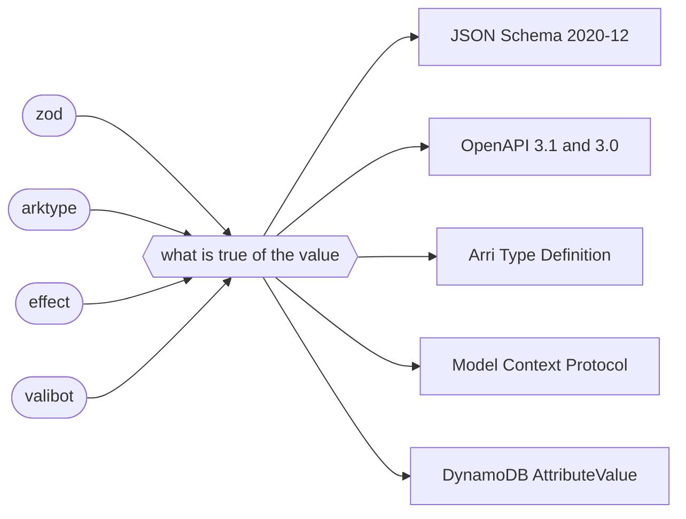

# fascia

Describe a schema once. Write it as anything.



Four validators and five targets: nine packages and a core, rather than twenty. A frontend reads a
schema into one term and a target writes that term down. Neither knows the other exists.

## The term holds no target's vocabulary

A validator says a thing and a target says the same thing with another word. The term says the
thing.

Nullability is one fact and five spellings: a flag in ATD, a member of a type list in 2020-12, a
branch joined to null where there is no type to widen, a `nullable` flag beside one type in
OpenAPI 3.0, and a member of the coproduct in DynamoDB. Every case of the term carries whether the
value may be null, and each target chooses its own word.

Optionality lives on the object's edge and not on the value, because a key that may be absent and a
value that may be null are two different statements. A whole number is a number that is whole, so
2020-12 names a type, ATD reads a width off the bounds, and neither word is in the term.

## A schema has two sides

A request body is what a caller sends and a response body is what comes back. The same schema stands
in both places and says different things there.

```ts
const User = z.object({ id: z.string(), role: z.string().default('reader') })
```

A caller may leave `role` out of what they send. It is always in what comes back. So a document
holding both sides holds two shapes, and this splits the name only where the sides differ:

```ts
import { spellOpenApi } from '@fasciajs/openapi'
import { zodSource } from '@fasciajs/zod'

const document = spellOpenApi(
  [{ path: '/users', method: 'post', body: User, responses: { '200': User } }],
  zodSource,
  {
    sides: { input: (name) => `New${name}`, output: (name) => name },
    named: new Map([[User, 'User']])
  },
  { title: 'Users', version: '1' }
)
```

```jsonc
"requestBody": { … "$ref": "#/components/schemas/NewUser" },   // role is optional
"responses": { "200": { … "$ref": "#/components/schemas/User" } }  // role is required
```

The schema was not touched. No identifier was written into it, and the two words are the caller's.

## Three outcomes, not two

A target either says what the term states, or says less and stays sound, or cannot say it at all.
Only the third is a failure.

```ts
const spelled = spellAtd(term)
spelled.departures   // what this target had no word for, and which way it moved
```

A departure states a direction. `wider` means the document accepts more than the schema, which costs
a caller a bad error message. `narrower` means the document refuses a value the schema takes, which
breaks a working client. `neither` means nothing about acceptance changed.

A caller decides which of those stops a build:

```ts
import { refusing } from '@fasciajs/core'

refusing(spelled, ['narrower'])   // the spelling, or the reason it is refused
```

## What it refuses

A refusal names the schema and says what to write instead.

A bigint and a date have no JSON form, so nothing states how one is written on the wire. Say it:
`z.iso.datetime()` is a string, and a codec's input side is whatever the wire carries.

A tagged disjunction over anything but objects has no ATD form. A reference has no DynamoDB form. A
tool whose arguments are a bare string is a tool no MCP client can call.

## The numbers

Every target with a reader is measured against generated schemas, from every frontend:

| target | oracle | narrower |
| --- | --- | --- |
| JSON Schema 2020-12 | Ajv | 0 |
| Arri Type Definition | arri's own reading, then Ajv | 0 |
| OpenAPI 3.0 against 3.1 | Ajv, both sides | 0 |

`narrower` is the count of values a schema accepts and its document refuses. Zero at seeds 1, 7 and
13 and depths 2, 3 and 4, from zod, arktype, effect and valibot.

```sh
npm run check                                   # every check, default seed
AGREEMENT_SEED=7 AGREEMENT_DEPTH=4 npx vitest run   # another draw
```

Widening is counted and printed rather than asserted, because this library widens on purpose in
places and a number moving is what a reader watches.

## The packages

| package | what it is |
| --- | --- |
| `@fasciajs/core` | the term, the reading it is built from, and the departures a target reports |
| `@fasciajs/zod` | a zod schema, read |
| `@fasciajs/arktype` | an arktype schema, read |
| `@fasciajs/effect` | an effect Schema, read |
| `@fasciajs/valibot` | a valibot schema, read |
| `@fasciajs/json-schema` | a term, written as JSON Schema 2020-12 |
| `@fasciajs/openapi` | operations, written as an OpenAPI 3.1 or 3.0 document |
| `@fasciajs/atd` | a term and a set of procedures, written for arri |
| `@fasciajs/mcp` | tools, written as Model Context Protocol definitions |
| `@fasciajs/dynamodb` | a term, written as the AttributeValue members a value may take |

Install the frontend you use and the target you want. Nothing pulls in a validator you do not have.

```sh
npm install @fasciajs/core @fasciajs/zod @fasciajs/openapi
```

## Working on it

Node 24, in the devcontainer at `.devcontainer/devcontainer.json`.

```sh
npm run check     # types, lint, and the suite
npm run build     # what each package publishes
npm run format    # apply the formatter
```

`CLAUDE.md` states the rules this code is written under. They are worth reading before changing
anything: a failure is a value, a switch over a sum ends in `satisfies never`, and a claim about
behaviour comes from output somebody saw.

## Licence

MIT.
